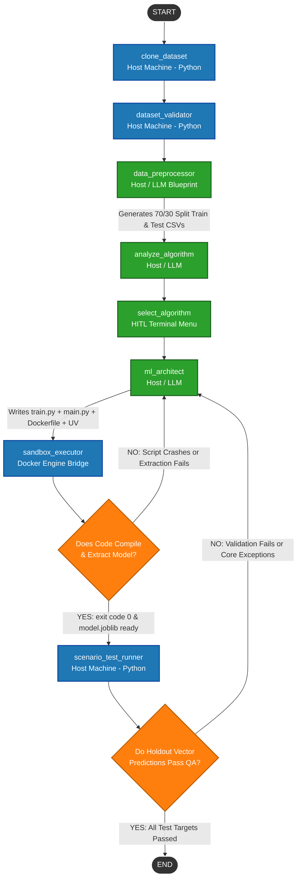

# Project Overview: Self-Healing Agentic AutoML System

## 1. Executive Summary

This project outlines the architecture for an advanced, autonomous **Automated Machine Learning (AutoML) Pipeline** powered by an **Agentic Self-Healing Inner Loop**. Unlike traditional AutoML systems that rely on rigid, brute-force parameter sweeps, this framework orchestrates a network of deterministic Python modules and specialized Large Language Model (LLM) agents.

The system programmatically handles single-file data collection directory structures. The core engine presents mathematically optimized algorithmic choices to the user via an interactive Human-in-the-Loop (HITL) steering gateway, constructs isolated training environments using Docker sandboxing, and builds automated data-science execution scripts.

To guarantee production reliability, models are subjected to behavioral validations over a genuine, unseen 30% holdout split generated at the preprocessing layer. If a runtime compilation exception occurs inside the Docker sandbox or an engineering data type constraint fails at prediction time, an isolated automated feedback loop takes over to self-heal and refactor the codebase exactly once (`iteration_count <= 1`) to eliminate runaway cycles.

---

## 2. System Architecture Flowchart



---

## 3. Node Descriptions & Functional Rules

### Node 1: `clone_dataset`

* **Execution Environment:** Host Machine (Deterministic Python)
* **Description:** Generates an isolated temporary path structure underneath `.temp/ml_agent_{cuid}/` and clones all raw target source files into it. This acts as the absolute first pipeline dependency guardrail to protect the original source tables from corruption.
* **LLM Dependency:** None.

### Node 2: `dataset_validator`

* **Execution Environment:** Host Machine (Deterministic Python)
* **Description:** Inspects the cloned temporary directory storage paths, builds structural schema metadata summaries, parses raw text columns, profiles file sizes, and builds inferred data type records to populate the state's `dataset_metadata`.
* **LLM Dependency:** None.

### Node 3: `data_preprocessor`

* **Execution Environment:** Host Machine / LLM Structured Output
* **Description:** Grabs a safe 10-row sample and invokes an LLM to generate a strict, Pydantic-validated numeric conversion blueprint pattern. It processes the dataset locally using those instructions, including handling missing values, converting datetimes into clean `_year`, `_month`, and `_day` fields, and numerically encoding text columns.
* **Deterministic Splitting Engine:** Once columns are converted to a clean numerical state, the node deterministically shuffles the dataset rows and splits them exactly **70/30**:
* `processed_dataset.csv`: 70% of rows used exclusively by downstream training modules.
* `test_dataset.csv`: 30% of rows saved as a pure, unseen validation holdout split.


### Node 4: `analyze_algorithm`

* **Execution Environment:** Host Machine / LLM Structured Output
* **Description:** Targets the primary preprocessed 70% training matrix. It profiles the engineered features data structure using a memory-safe glimpse to determine whether the target data properties match regression, classification, or clustering layouts and scores candidate frameworks (`scikit-learn` vs `xgboost`).

### Node 5: `select_algorithm`

* **Execution Environment:** Interactive Terminal Steering Menu (HITL)
* **Description:** Halts automated processing cycles and presents the model recommendation grid to the user. It leverages the `ask_human` command-line control panel to let developers explicitly review selections, performance scores, and architectural justifications, locking in the configuration strategy before code synthesis begins.

### Node 6: `ml_architect`

* **Execution Environment:** Host Machine / LLM Structured Output
* **Description:** Generates a standalone, end-to-end Python training script (`train.py`) and a standalone holdout metric scoring script (`main.py`) inside the workspace root.
* **Local UV Environment Support:** Natively scaffolds a local Python project (`pyproject.toml`) and compiles an isolated virtual environment (`.venv`) via a global `uv` command subprocess right inside the active temporary workspace folder for lightning-fast manual engineering testing.
* **Manual Container Testing Track:** Writes a structural `Dockerfile` to the workspace root, mapping out clear environment instructions for developers to recreate, build, evaluate, or re-train identical container environments manually.

### Node 7: `sandbox_executor`

* **Execution Environment:** Docker Engine Bridge (Deterministic Python)
* **Description:** Mounts the preprocessed workspace directory into an isolated container. It coordinates package dependencies installation and runs the generated `train.py` code. If a script crashes, it captures the error logs (`stderr`) to loop back to the architect. If successful, it bypasses Windows path separator conversion boundaries to safely extract the `model.joblib` artifact file from the stopped container filesystem layer using a raw POSIX stream archive copy.

### Node 8: `scenario_test_runner`

* **Execution Environment:** Host Machine (Deterministic Python)
* **Description:** Instantiates the trained `model.joblib` binary artifact directly into local memory. It loops through rows sampled from the 30% holdout split (`test_dataset.csv`) to calculate operational predictions.
* **Strict Type Coercion Alignment:** Prior to running model inference, it looks up the original processed training data types on disk and casts the test rows to match their exact data types (`dtypes`), completely stripping out generic python string `object` anomalies that trigger framework projection crashes.
* **Pydantic Validation Grading:** Submits the prediction metrics to an LLM evaluator using a clean, Pydantic-enforced layout schema (`BehavioralEvaluationGrading`). If the model's outputs contradict logical behavior rules or ground truth boundaries, it generates a failure trace report to activate code repair paths.

---

## 4. Operational Guardrails & Design Principles

* **True Holdout Separation:** Replaced synthetic test generation with strict 70/30 matrix partitioning, ensuring model evaluations are backed by real, unseen historical dataset sequences.
* **Cross-Platform Path Resiliency:** All container extraction operations enforce POSIX forward-slash conventions, eliminating mixed separator path crashes (`/workspace\model.joblib`) on Windows host machines.
* **Automated Developer Hand-off:** Every run scaffolds a clean project workspace complete with a local virtual environment (.venv) via `uv` and a debugging `Dockerfile`, enabling seamless local testing tracks.
* **Runaway Loop Protection:** Employs strict circuit breakers (`iteration_count > 1`) across both compilation and test validation checkpoints, immediately halting downstream nodes if a code fix fails.

---

## 5. Local Sandbox Command Reference

When a pipeline completes or halts, developers can interact with the temporary workspace `.temp/ml_agent_{cuid}/` using these native commands:

### Running via Local Host Environment (`uv`)

```bash
# 1. Navigate straight to the temporary workspace directory
cd .temp/ml_agent_xxxx

# 2. Synchronize the pre-scaffolded UV project libraries
uv sync

# 3. RUN MODEL INFRASTRUCTURE TESTS (Evaluates model.joblib against test_dataset.csv)
uv run python main.py

# 4. Optional: Re-train the model locally from scratch
uv run python train.py

```

### Running via Local Docker Sandbox (`Dockerfile`)

```bash
# 1. Build the local debugging sandbox container image using a strict local namespace tag
docker build -t local/manual-test-model:v1 .

# 2. RUN MODEL INFRASTRUCTURE TESTS INSIDE CONTAINER (Default task runs main.py)
docker run --rm -it local/manual-test-model:v1

# 3. Optional: Re-train the model inside the container sandbox from scratch
docker run --rm -it local/manual-test-model:v1 python train.py

# 4. Open an interactive bash session inside the sandbox container for debugging
docker run --rm -it local/manual-test-model:v1 bash

```