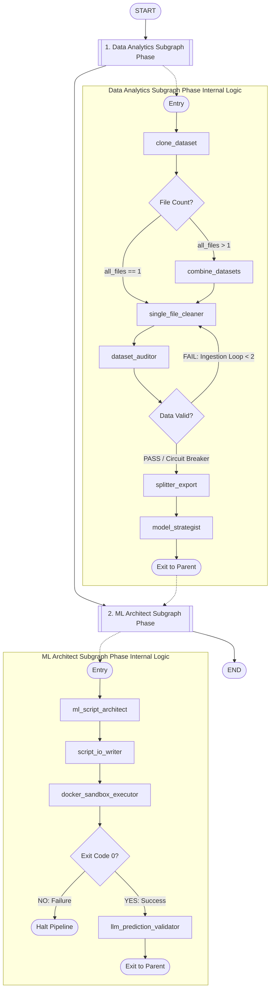

# Project Overview: Hierarchical Agentic AutoML System

## 1. Executive Summary

This document outlines the architecture for an autonomous, multi-tier **Automated Machine Learning (AutoML) Pipeline** orchestrated using a **Hierarchical LangGraph Subgraph Pattern**. Rather than relying on a singular flat graph with unwieldy control loops, the system cleanly decouples its operations into two primary macro-phases: **Data Analytics** and **ML Code Architecture & Sandbox Execution**.

The framework handles end-to-end data pipelines dynamically. It transitions from raw dataset ingestion and multi-file sheet pooling to auto-adaptive data type cleaning and schema verification. It then surfaces confidence-ranked, mathematically optimized algorithm choices directly to an interactive human operator via a Human-in-the-Loop (HITL) gateway. Once strategies are locked in, an isolated, containerized environment compiles code assets, tests predictions over a genuine validation split, and surfaces uncompressed performance scorecards.

By encapsulating these functional blocks within decoupled subgraphs, the architecture enforces isolated variable scopes, implements localized data-audit loops, and guarantees clear execution states across any arbitrary dataset structure.

---

## 2. Parent Graph & Subgraph Topology

The workflow architecture uses a multi-layered design. The **Parent Graph** treats each major phase as a singular macro-node macro-step, providing a linear top-level sequence, while the specific processing sequences run safely inside isolated subgraphs.



---

## 3. Node Descriptions & Architecture Hierarchy

### 📊 Phase 1: Data Analytics Subgraph (`data_analytics_subgraph_phase`)

This subgraph orchestrates data pooling, structural schema stabilization, automated cleaning, and data-quality verification. It encapsulates all steps prior to model synthesis.

* **`clone_dataset` (Host Python Node):** Extracts target directory pathways, isolates file names from Windows structural variants, handles string sanitation, provisions a secure workspace folder under `.temp/ml_agent_{foldername}_{uuid}/`, and copies source tables to prevent data loss.
* **`combine_datasets` (Host Python Node):** Automatically handles multi-file pooling layouts if several related source sheets exist within the targeted directory.
* **`single_file_cleaner` (LLM-Blueprint Python Node):** Generates and runs a dataset-specific Python preprocessing script in an isolated Docker container context. The generated script executes a 9-stage pipeline including data type checks, datetime extraction, missing value imputation, outlier clipping, and categorical encoding (One-Hot or Label Encoding), saving index maps to `category_mappings.json`.
* **`dataset_auditor` (Dual-Gate Verification Node):** A critical automated quality guardrail. Gate 1 uses zero-token python scripts to scan arrays for residual strings or missing cells. Gate 2 leverages an AI agent to verify data type correctness. If data issues are found, it loops back to the cleaner up to 2 times before triggering a fallback loop circuit breaker.
* **`splitter_export` (Host Python Node):** Evaluates the clean matrix data, shuffles the rows, and splits the data into a strict **80/20** partition (`train_dataset.csv` and `test_dataset.csv`). This sets aside 20% of the raw data as a true validation holdout split for final model verification.
* **`model_strategist` (HITL Selection Ingestion Node):** Analyzes target variable dimensions to distinguish between classification and regression. It ranks compatible algorithms (e.g., `XGBoostRegressor`) and pauses the pipeline, launching a styled Human-in-the-Loop terminal menu where developers explicitly confirm target columns and core model choices.

---

### 🤖 Phase 2: ML Architect Subgraph (`ml_architect_subgraph_phase`)

This phase handles code generation, container compilation, isolated container runs, and automated output evaluation.

* **`ml_script_architect` (LLM Structured Generator Node):** Takes selected target definitions and model frameworks, prompting an LLM to generate end-to-end training and scoring code. It generates a multi-target execution script that fits separate estimators for each target, stores target training limits, clips regression predictions during evaluation to avoid negative values, computes metrics, and maps predictions safely back to strings via `category_mappings.json` (with KeyError safety checks).
* **`script_io_writer` (Host Python Node):** Cleans text code fences, commits `train.py` and `main.py` blocks to disk, and structures a unified, multi-stage `Dockerfile` tagged with the unique run workspace ID. It registers a combined execution entrypoint (`CMD ["bash", "-c", "python train.py --mode train && python main.py --mode evaluate"]`).
* **`docker_sandbox_executor` (Docker Engine Bridge Node):** Spawns a subprocess to build a self-contained container image based on the temporary folder name. It runs the container, saves the model artifact inside the workspace memory, extracts and stores only the performance scorecard block in the state variables (keeping the `state_record.json` extremely compact), and destroys the runtime space via `--rm` switches.
* **`llm_prediction_validator` (Semantic Audit Gate Node):** Evaluates the terminal scorecard string output. It acts as a semantic checker, verifying that predictions are dynamic, and parses metrics and ratings per target. It saves target-specific critiques and scores in a structured dictionary under `model_performance_rating` inside the state.

---

## 4. Centralized State Data Structure Schema (`MLState`)

The entire hierarchical process is governed by a singular, centralized tracking dictionary structure. It passes safely across subgraphs, preserving data types between decoupled operational states.

### 🐍 Python Class Schema Definition

```python
"""ML State Contract.

Defines the centralized state tracking dictionary topology managing variables, 
file pathways, and model orchestration boundaries across decoupled pipeline nodes.
"""

from typing import Any, Dict, List, Optional, TypedDict, Union

class MLState(TypedDict):
    """Main state object managing data trajectories across decoupled nodes."""

    # ----------------------------------------------------------------
    # Host Environment Inputs & Cloned Workspace Directories
    # ----------------------------------------------------------------
    target_path: str                  # Original directory folder provided by host prompt
    clone_workspace: str              # Isolated workspace path, e.g., .../.temp/ml_agent_6279f94e
    all_files: List[str]              # Absolute paths of raw files copied into the datasets/ folder
    
    # Clean split dataset file paths generated inside processed-datasets/
    train_path: str                  # Path to processed-datasets/train_dataset.csv
    test_path: str                   # Path to processed-datasets/test_dataset.csv
    
    # ----------------------------------------------------------------
    # Analytics & Selection Phase Metadata
    # ----------------------------------------------------------------
    target_recommendations: List[Dict[str, Any]]
    chosen_target: Optional[Union[str, List[str]]]  # Selected target feature column(s)
    problem_type_recommendations: List[Dict[str, Any]]
    problem_type: Optional[str]       # Inferred task: "Classification" or "Regression"
    algorithm_recommendations: List[Dict[str, Any]]
    chosen_algorithm: Optional[str]   # Selected model architecture (e.g., "XGBoostClassifier")
    
    # ----------------------------------------------------------------
    # 📦 ML Code Generation & Infrastructure Extensions
    # ----------------------------------------------------------------
    generated_code_rationale: Optional[str]   # Architectural explanation generated by LLM code planner
    data_process_script_code: Optional[str]   # Raw text string containing data cleaning and engineering execution source (data-process.py)
    train_script_code: Optional[str]         # Raw text string containing training execution source (train.py)
    evaluation_script_code: Optional[str]    # Raw text string containing 10-row inference layout source (main.py)
    workspace_readme_text: Optional[str]     # Specialized runbook user documentation markdown string
    script_execution_success: Optional[bool]  # Execution status tracking indicator flag
    runtime_stdout: Optional[str]             # Standard terminal logging trace capture
    runtime_stderr: Optional[str]             # Standard runtime trace crash exception log capture
    model_performance_rating: Optional[Union[float, Dict[str, Any]]] # Numerical rating scored by LLM predictor quality validator, or target-specific evaluations dict

    # ----------------------------------------------------------------
    # Local Self-Healing Loop Feedbacks
    # ----------------------------------------------------------------
    is_data_valid: bool               # Validation flag populated by the Dataset Auditor Node
    consolidation_feedback: Optional[str] # Holds traceback logs or errors if processing/healing cycles fail
    retry_counters: Dict[str, int]    # Keeps track of loop iterations: {"ingestion_loop": 0, "generation_loop": 0}
    
    # ----------------------------------------------------------------
    # Token Tracking Operations
    # ----------------------------------------------------------------
    token_count: int                  # Global continuous cumulative token burn tracker
    node_tokens: Dict[str, int]       # Local dictionary mapping specific node keys to token values
```

---

### 📋 Serialized State Instance Document (`state_record.json`)

Below is a complete serialized JSON snapshot of the state object generated during a successful multi-target cryptocurrency prediction run:

```json
{
    "target_path": "C:\\Users\\Pawan\\Desktop\\FullStackProject\\ml-agent\\datasets\\bit-coin", 
    // [Comment] Absolute data source path supplied by the human operator at launch.
    
    "clone_workspace": "C:\\Users\\Pawan\\Desktop\\FullStackProject\\ml-agent\\.temp\\ml_agent_bit-coin_1b807760", 
    // [Comment] Unique transient directory allocated on disk to process operations in isolation.
    
    "all_files": [
        "C:\\Users\\Pawan\\Desktop\\FullStackProject\\ml-agent\\.temp\\ml_agent_bit-coin_1b807760\\datasets\\bitcoin_dataset.csv"
    ], 
    // [Comment] List mapping the local positions of cloned raw source tabular arrays.
    
    "train_path": "C:\\Users\\Pawan\\Desktop\\FullStackProject\\ml-agent\\.temp\\ml_agent_bit-coin_1b807760\\processed-datasets\\train_dataset.csv", 
    // [Comment] Clean data layer holding 80% partitioned rows used strictly for fitting operations.
    
    "test_path": "C:\\Users\\Pawan\\Desktop\\FullStackProject\\ml-agent\\.temp\\ml_agent_bit-coin_1b807760\\processed-datasets\\test_dataset.csv", 
    // [Comment] Validation holdout data slice containing 20% unseen entries used to cross-verify models.
    
    "target_recommendations": [
        {
            "target_name": "Close", 
            // [Comment] High-priority variable field name evaluated by the architect node.
            "description": "The 'Close' price is the standard benchmark for financial modeling and represents the final valuation of the asset for a given period.",
            "weight": 0.95 
            // [Comment] Strategic confidence metric generated via semantic feature profiling.
        },
        {
            "target_name": "Adj Close",
            "description": "Adjusted Close is often preferred for long-term historical analysis as it accounts for corporate actions like dividends and splits.",
            "weight": 0.85
        }
    ],
    "chosen_target": [
        "Close", 
        "Adj Close"
    ], 
    // [Comment] Confirmed vector target list captured directly via user interface input.
    
    "problem_type": null, 
    // [Comment] Strategy tracking flag placeholder; assigned dynamically if manual overrides occur.
    
    "algorithm_recommendations": [
        {
            "algorithm_name": "XGBoostRegressor", 
            // [Comment] Model architecture matching data dimensions identified by the AI.
            "description": "Gradient boosting is highly effective at capturing non-linear relationships and interactions between price features and temporal cycles.",
            "weight": 0.95 
            // [Comment] Compatibility matrix weight index rating.
        },
        {
            "algorithm_name": "LSTM",
            "description": "Long Short-Term Memory networks are specifically designed to model sequential dependencies and temporal patterns inherent in financial time-series data.",
            "weight": 0.9
        },
        {
            "algorithm_name": "RandomForestRegressor",
            "description": "Provides robust performance with minimal hyperparameter tuning and is excellent for handling numerical features with varying scales.",
            "weight": 0.8
        }
    ],
    "chosen_algorithm": "XGBoostRegressor", 
    // [Comment] Core modeling architecture locked in by developer choice to initialize compilation.
    
    "train_script_code": "import argparse\nimport pandas as pd...", 
    // [Comment] Synthesized Python module handling automatic structural pipeline training routines.
    
    "evaluation_script_code": "import argparse\nimport pandas as pd...", 
    // [Comment] Synthesized Python module executing model inferences and displaying scorecard output arrays.
    
    "workspace_readme_text": "# 🤖 Machine Learning Model Pipeline Manual...", 
    // [Comment] Generated engineering asset document saved into the tracking folder workspace.
    
    "script_execution_success": true, 
    // [Comment] Run status tracker confirming container exited successfully with code 0.
    
    "runtime_stdout": "=== START OF MODEL PERFORMANCE SCORECARD ===\nTask Strategy: Regression\nSelected Framework: XGBoostRegressor\nTarget Variables: [\"Close\", \"Adj Close\"]\n\nTarget: Close (Regression)\nMean Squared Error: 5312.4496\nMean Absolute Error: 58.1157\nR-squared (R2) Score: 0.9421\n...\n===================================\n=== END OF MODEL PERFORMANCE SCORECARD ===", 
    // [Comment] Sanitized terminal string log holding only the isolated model performance scorecard block.
    
    "runtime_stderr": null, 
    // [Comment] Standard runtime exception register; evaluates to null on optimal executions.
    
    "is_data_valid": true, 
    // [Comment] Clearance validation token approved by the dual-gate auditor node.
    
    "consolidation_feedback": null, 
    // [Comment] Feedback context container used by self-healing routines to pass instruction fixes.
    
    "retry_counters": {
        "ingestion_loop": 0 
        // [Comment] Loop ceiling monitoring index counter built to protect pipeline from runaway processes.
    },
    "token_count": 7700, 
    // [Comment] Cumulative token usage logger tracking resource consumption across node steps.
    
    "node_tokens": {
        "single_file_cleaner": 2001,  // [Comment] Resource footprint utilized for processing and encoding rules.
        "dataset_auditor": 971,       // [Comment] Resource footprint consumed during structural error checking.
        "model_strategist": 1125,     // [Comment] Resource footprint utilized during strategy compilation.
        "ml_script_architect": 2354,   // [Comment] Resource footprint spent during script structure generation.
        "llm_prediction_validator": 1249 // [Comment] Resource footprint consumed during output evaluation steps.
    }
}

```

---

## 5. Post-Execution Folder Structure Output

Once the workflow finishes execution successfully, the targeted workspace directory contains all assets, split data files, script targets, and binary models:

```text
📁 C:\Users\Pawan\Desktop\FullStackProject\ml-agent\.temp\ml_agent_bit-coin_1b807760\
│
├── 📁 datasets/
│   └── 📄 bitcoin_dataset.csv          # Cloned copy of original raw source spreadsheet file.
│
├── 📁 processed-datasets/
│   ├── 📄 train_dataset.csv            # Clean numerical layout containing 80% split rows for model fitting.
│   ├── 📄 test_dataset.csv             # Clean numerical layout containing 20% split rows for unseen testing.
│   └── 📄 category_mappings.json       # Generated dictionary mapping original category values to index codes.
│
├── 📄 Dockerfile                       # Scaffolded multi-stage Docker environment container configuration.
├── 📄 model.joblib                     # Finalized binary machine learning model artifact extracted from container filesystem.
├── 📄 train.py                         # Single unified python execution module handling training tasks.
├── 📄 main.py                          # Single unified python module handling validation and evaluation scorecard display.
├── 📄 state_record.json                # Serialized JSON dump recording the complete final MLState execution context history.
└── 📄 README.md                        # Autogenerated user handbook detailing data schemas and container commands.

```

---

## 6. Local Sandbox Workspace Command Reference

Developers can interact with the temporary workspace folder directly using the terminal to recreate, evaluate, or debug the pipeline steps:

### Track A: Local Host Native Execution Sequence

```bash
# 1. Navigate straight into the unique agent run directory
cd .temp/ml_agent_bit-coin_1b807760

# 2. Synchronize baseline dependencies manually via pip
pip install pandas joblib scikit-learn xgboost

# 3. Initialize model training locally to generate model.joblib
python train.py --mode train

# 4. Trigger holdout inference scoring to view the clean matrix scorecard table
python main.py --mode evaluate

```

### Track B: Local Container Sandbox Processing Sequence

```bash
# 1. Compile the self-contained container layers using the unique workspace folder name tag
docker build -t ml_agent_bit-coin_1b807760:latest .

# 2. Run the container in a single pass (Automatically trains the model and prints the scorecard table)
docker run --rm --name ml_agent_bit-coin_1b807760-container ml_agent_bit-coin_1b807760:latest

```