Here is your updated, production-ready **Project Overview Document**.

A new conditional routing layer (`Check File Count?`) has been injected immediately after the dataset validation step. If a single file is present, the pipeline bypasses the `relational_mapper` entirely and routes directly to the `algorithm_selector` to optimize parameters for the user's manual selection. If multiple tables are found, it maps out the relational schema automatically before continuing.

---

# Project Overview: Self-Healing Agentic AutoML System

## 1. Executive Summary

This project outlines the architecture for an advanced, autonomous **Automated Machine Learning (AutoML) Pipeline** powered by an **Agentic Self-Healing Inner Loop**. Unlike traditional AutoML systems that rely on rigid, brute-force parameter sweeps, this framework orchestrates a network of deterministic Python modules and specialized Large Language Model (LLM) agents.

The system programmatically handles both single-file datasets and multi-table directory structures. When multiple files are detected, a relational layout mapper dynamically establishes data topology hierarchies. The core engine presents mathematically optimized algorithmic choices to the user, constructs isolated training environments using Docker sandboxing, and builds automated data-science execution scripts.

To guarantee production reliability, models are subjected to adversarial behavioral edge-case tests. If a runtime compilation exception occurs or an engineering constraint fails, an isolated automated feedback loop takes over to self-heal and refactor the code base without human intervention.

---

## 2. System Architecture Flowchart

```mermaid
graph TD
    %% Define Node Styles
    classDef startEnd fill:#333,stroke:#fff,stroke-width:2px,color:#fff;
    classDef hostNode fill:#1f77b4,stroke:#0d47a1,stroke-width:2px,color:#fff;
    classDef llmNode fill:#2ca02c,stroke:#1b5e20,stroke-width:2px,color:#fff;
    classDef decision fill:#ff7f0e,stroke:#b85c00,stroke-width:2px,color:#fff;

    %% Initial Workflow Ingestion
    START([START]) --> dataset_validator[dataset_validator <br> Host Machine - Python]
    dataset_validator --> file_count_check{Check File Count?}

    %% Conditional Relational Routing
    file_count_check -- If Multiple Files > 1 ----> relational_mapper[relational_mapper <br> Host / LLM]
    relational_mapper --> algorithm_selector[algorithm_selector <br> Host / LLM]
    
    file_count_check -- If Single File = 1 ----> algorithm_selector

    %% Main Code Generation & Prepping
    algorithm_selector --> scenario_generator[scenario_generator <br> Host / LLM]
    scenario_generator --> ml_architect[ml_architect <br> Host / LLM]
    
    ml_architect --> docker_sandbox_prepper[docker_sandbox_prepper <br> Host Machine - Python]
    docker_sandbox_prepper --> docker_sandbox_executor[docker_sandbox_executor <br> Docker Engine Bridge]
    
    %% Execution Evaluation Point (Self-Healing Loop 1)
    docker_sandbox_executor --> code_status{Code Status?}
    code_status -- IF Code Crashes --> ml_architect
    
    code_status -- IF Code Succeeds --> scenario_test_runner[scenario_test_runner <br> Host Machine - Python]
    
    %% Testing Evaluation Point (Self-Healing Loop 2)
    scenario_test_runner --> test_status{Test Status?}
    test_status -- IF Any Test Fails --> ml_architect
    
    test_status -- IF All Tests Pass --> production_artifact_saver[production_artifact_saver <br> Host Machine - Python]
    production_artifact_saver --> END([END])

    %% Assign Style Classes
    class START,END startEnd;
    class dataset_validator,docker_sandbox_prepper,docker_sandbox_executor,scenario_test_runner,production_artifact_saver hostNode;
    class relational_mapper,algorithm_selector,scenario_generator,ml_architect llmNode;
    class file_count_check,code_status,test_status decision;

```

---

## 3. Node Descriptions & Functional Rules

### Node 1: `dataset_validator`

* **Execution Environment:** Host Machine (Deterministic Python)
* **Description:** Inspects target directory storage points from the outside. It determines whether the system is analyzing a single, isolated flat file or a directory structure tracking a multi-table schema. It computes sizes, parses raw rows, validates baseline structure configurations, and handles safety downsampling strategies to preserve 16GB RAM limits.
* **LLM Dependency:** None.

### Conditional Split: `Check File Count?`

* **Logic Rules:** Evaluates file count values output by the validation node. If count matches exactly 1, it skips downstream structural merging layers to directly trigger algorithmic task analysis. If the file count is greater than 1, it routes execution into the schema building pipelines.

### Node 2: `relational_mapper`

* **Execution Environment:** Host Machine / LLM Structured Output
* **Description:** Analyzes isolated table structures to establish relational graph hierarchies. It locates common primary/foreign joining keys and differentiates between Master Parent Tables (containing unified, unique ID entries) and Dependent Child Tables (tracking transactional histories or temporal log paths) to map out sequential joining topologies.
* **JSON Output Schema:** Maps relationship configurations, lists target file chains, establishes tracking join identifiers, and generates specific multi-file aggregation/merging workflows.

### Node 3: `algorithm_selector`

* **Execution Environment:** Host Machine / LLM Structured Output
* **Description:** Evaluates the structural layout of the ingestion target (or the newly mapped master table) to choose optimal classes of modeling estimators. It identifies whether the target requires Binary Classification, Multi-Class Classification, or Regression, checks for severe target skewness (e.g., class ratios dropping below 5%), and establishes appropriate class-weight balancing configurations.
* **User Interaction Gate:** This node provides users with explicit, mathematically optimal modeling recommendations based on their data layout, allowing the user to select their desired path before execution continues.
* **JSON Output Schema:** Declares ML task targets, severe imbalance flags, exact suggested estimator module paths, base parameter configurations, and scientific justifications.

### Node 4: `scenario_generator`

* **Execution Environment:** Host Machine / LLM Structured Output
* **Description:** Acts as an automated Quality Assurance Engineer to design behavioral evaluation test suites. It reviews feature spaces and selected algorithms to mock realistic behavioral data matrices containing extreme outlier paths, corrupt values, missing entries, and distinct persona rows.
* **JSON Output Schema:** Structuring arrays containing clear descriptive text flags, input dictionary matrices, and targeted logical outputs without mixing inline target elements into features.

### Node 5: `ml_architect`

* **Execution Environment:** Host Machine / LLM Structured Output
* **Description:** Writes raw, self-contained Python training script strings. The code blocks are dynamically structured to handle multi-file relational joins (if flagged by the state machine) or process single-table ingestion pipelines directly. It formats missing entries, encodes text categorical columns, normalizes feature distributions, trains selected models, and serializes output assets.
* **Self-Healing Mechanics:** Consumes historical tracing files. If standard error outputs catch a runtime python exception or if behavioral assertions flag model alignment anomalies, it locates structural source bugs and applies programmatic fixes.
* **JSON Output Schema:** Declares targeted pip execution packages alongside the clean, raw stringified Python source block without markdown backtick text blocks.

### Node 6: `docker_sandbox_prepper`

* **Execution Environment:** Host Machine (Deterministic Python)
* **Description:** Prepares isolated build paths, moves working local copies of original source tables into execution tracking mounts, and compiles text code representations directly into concrete files.
* **LLM Dependency:** None.

### Node 7: `docker_sandbox_executor`

* **Execution Environment:** Docker Engine Bridge (Deterministic Python)
* **Description:** Initialises isolated, secure runtime environments using local container engines. It coordinates package installs, triggers script executions, and catches structural output flags. Runtime processing faults intercept standard error structures (`stderr`) to automate feedback redirection to the architecture generation systems.
* **LLM Dependency:** None.

### Node 8: `scenario_test_runner`

* **Execution Environment:** Host Machine (Deterministic Python)
* **Description:** Instantiates the compiled model object directly into local memory spaces and passes behavioral testing rows through the inference pipeline. If calculated labels contradict structural validation rules created by QA nodes, it registers failure logs to loop back into self-healing architectures.
* **LLM Dependency:** None.

### Node 9: `production_artifact_saver`

* **Execution Environment:** Host Machine (Deterministic Python)
* **Description:** Saves proven model configurations and scaling pipelines to final deployments, purges temporary container steps, and drops runtime sandbox assets to cleanly wrap processing cycles.
* **LLM Dependency:** None.

---

## 4. Operational Guardrails & Design Principles

* **Dynamic Ingestion Adaptability:** Seamlessly transitions execution paths between simple, single-table profiles and compound, multi-file relational architectures based on deterministic validation.
* **Human-in-the-Loop Integration:** Provides an intentional algorithmic recommendation layer, letting users explicitly steer the model selection process while automating downstream engineering tasks.
* **Isolated Environment Sandboxing:** Restricts untrusted script code execution exclusively inside throwaway Docker runtime layers to secure parent operating environments.
* **Runaway Loop Mitigation:** Employs explicit tracking state counters to break automated healing execution pathways if error states fail to resolve after a set threshold.