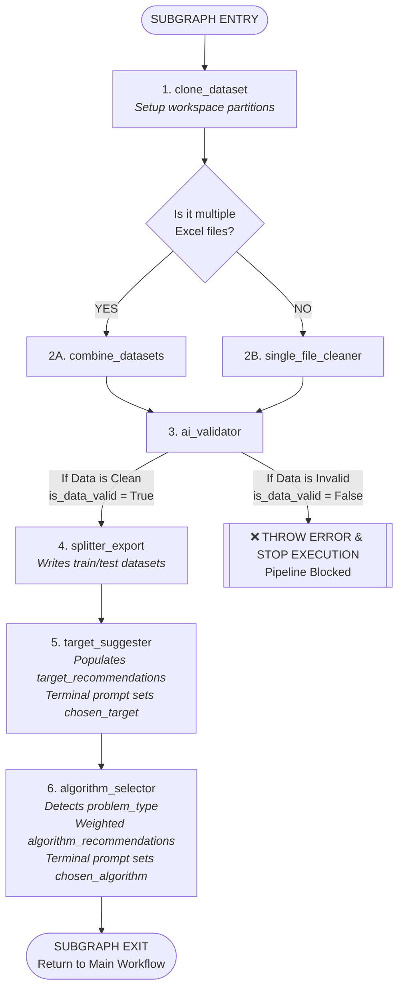

# 📦 Subgraph Specification: Data Analytics & Ingestion Flow

This document serves as the master blueprint for the isolated **Data Analytics & Ingestion Subgraph** of the Automated Machine Learning pipeline. It captures the local state variables, the internal operational flow with its immediate circuit-breaker path, and detailed node definitions.

---

## 🛠️ 1. Subgraph State Contract (MLState)

This subgraph directly consumes the shared parent `MLState` dictionary. The specific keys utilized, updated, or evaluated during this local lifecycle phase are:

```python
from typing import TypedDict, Optional, List, Dict, Any

class MLState(TypedDict):
    # ----------------------------------------------------------------
    # Workspace Inputs & Staging Folders
    # ----------------------------------------------------------------
    target_path: str                 # Entry directory path provided by user prompt
    clone_workspace: str             # Isolated subgraph root (.temp/ml_agent_datasetfolderName_{cuid})
    all_files: List[str]             # Absolute paths of copied raw source spreadsheets
    
    # Target partitioned file destinations written by the splitting node
    train_path: str                  # Path to processed-datasets/train-dataset.csv
    test_path: str                   # Path to processed-datasets/test-dataset.csv
    
    # ----------------------------------------------------------------
    # Target Suggestion Metadata (Step 1 of Predictive Setup)
    # ----------------------------------------------------------------
    target_recommendations: List[Dict[str, str]] # Array: [{"target_name": "...", "description": "..."}]
    chosen_target: Optional[str]     # Selected target string confirmed via HITL prompt (y)
    
    # ----------------------------------------------------------------
    # Algorithm Selection Metadata (Step 2 of Predictive Setup)
    # ----------------------------------------------------------------
    problem_type: Optional[str]      # Inferred mathematical task: "Classification" or "Regression"
    algorithm_recommendations: List[Dict[str, Any]] # Array: [{"algorithm_name": "...", "weight": 0.95, "reasoning": "..."}]
    chosen_algorithm: Optional[str]  # Confirmed algorithm selection chosen by the user
    
    # ----------------------------------------------------------------
    # Local Loop Feedbacks & Tokens
    # ----------------------------------------------------------------
    is_data_valid: bool              # Safety flag updated by the AI Validator Node (True/False)
    consolidation_feedback: Optional[str] # Exception traceback strings if cleaner/combiner scripts crash
    retry_counters: Dict[str, int]   # Iteration limit guardrails, e.g., {"ingestion_loop": 0}
    token_count: int                 # Global cumulative token burn counter
    node_tokens: Dict[str, int]      # Tracked token burn map per node key

```

---

## 🏎️ 2. Subgraph Execution Flow



---

## 🔍 3. Subgraph Node Definitions

### Phase A: Structural Data Processing (File & Schema Level)

#### 1. `clone_dataset` (Environment Worker)

* **Function:** Inspects the raw host path. Generates a unique local temporary root sandbox (`.temp/ml_agent_datasetfolderName_{cuid}/`) and handles folder isolation by making two internal subdirectories: `datasets/` (holds the exact copied source sheets) and `processed-datasets/` (reserved for final generated splits).
* **State Updates:** Registers the absolute path string to `clone_workspace` and adds each copied file path to `all_files`.

#### 2A. `combine_datasets` (AI-Driven Generator)

* **Function:** Invoked conditionally when multiple data files exist in `all_files`. Extracts a tiny, memory-safe, 3-row snapshot from each file to map out their columns. The LLM reviews these layouts and creates a customized python pandas recipe (using vertical stacking concatenation or horizontal relational key merging) to weld the files together.
* **State Updates:** Code output is executed locally to output `consolidated_master.csv` inside the `datasets/` folder. If processing or merging fails, logs the Python stack trace string into `consolidation_feedback`.

#### 2B. `single_file_cleaner` (AI-Driven Generator)

* **Function:** Invoked conditionally when only one source file exists in `all_files`. Extracts the top 10 records and passes them to the LLM to inspect for messy string units (such as columns containing `$`, text symbols, commas, or labels like `300 km` or `12 kg`). It compiles and runs an automated regex extraction routine to cast those mixed elements into clean numerical float data types.
* **State Updates:** Saves the sanitized dataset out as `consolidated_master.csv`. Logs parsing errors into `consolidation_feedback`.

#### 3. `ai_validator` (Automated Critic Safety Gate)

* **Function:** Samples a small, randomized window of rows from the outputted `consolidated_master.csv`. It feeds this data context block to an LLM auditor to verify structural integrity (valid numbers, balanced shapes, and uncorrupted headers).
* **State Updates:** If the dataset structure is clean, it flips `is_data_valid` to `True`. If column alignments are broken or values are corrupt, it flips the key to `False` and immediately triggers the circuit-breaker crash edge to halt all system operations.

#### 4. `splitter_export` (Data Partition Worker)

* **Function:** Runs right after `is_data_valid` is verified as `True`. Slices the compiled `consolidated_master.csv` into a training set and an independent validation testing set using a fixed split configuration.
* **State Updates:** Saves the data and assigns the absolute file locations directly into the `train_path` and `test_path` state keys.

---

### Phase B: Predictive Configuration Analytics (Target & Model Level)

#### 5. `target_suggester` (AI Analysis + HITL UI Panel)

* **Function:** Evaluates the standardized structural layout of `train_path`. The AI analyzes column semantic patterns to identify features that represent viable machine learning targets. It packages these possibilities into structured objects and passes them directly to your `ask_human` panel utility to render an interactive configuration menu on your CLI terminal.
* **State Updates:** Overwrites and locks the exact chosen string key into `chosen_target`, while logging the full recommendation payload trace to `target_recommendations`.

#### 6. `algorithm_selector` (AI Analysis + HITL UI Panel)

* **Function:** Extracts a quick row-preview block isolating data specifically within the `chosen_target` feature column. The AI inspects the value properties to determine the core mathematical task type (setting `problem_type` to either `"Classification"` or `"Regression"`).
It then builds out a structured array of relevant model options, ranking each strategy with a justification description and a compatibility confidence weight. It prints this recommendation dashboard to your terminal CLI via `ask_human` for final user confirmation.
* **State Updates:** Commits the final selected model string into `chosen_algorithm`, successfully concluding the subgraph's tracking lifecycle before returning execution control back up to your primary parent code-architect layers.