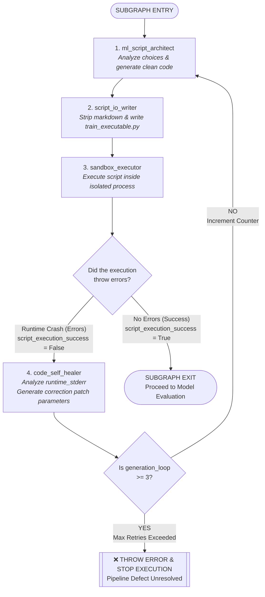

# 📦 Subgraph Specification: ML Code Architecture & Sandbox Execution Flow

This document serves as the master blueprint for the isolated **ML Code Architecture & Sandbox Execution Subgraph** of the Automated Machine Learning pipeline. It captures the global state variables, the internal operational loop layout, and deep programmatic node definitions.

---

## 🛠️ 1. Subgraph State Contract (`MLState`)

This subgraph reads, updates, and passes along the complete, unified parent `MLState` dictionary. The variables are managed within a continuous tracking layout:

```python
from typing import TypedDict, Optional, List, Dict, Any, Union

class MLState(TypedDict):
    """Main state object managing data trajectories across decoupled nodes."""
    
    # ----------------------------------------------------------------
    # Host Environment Inputs & Cloned Workspace Directories
    # ----------------------------------------------------------------
    target_path: str                 # Original directory folder provided by host prompt
    clone_workspace: str             # Isolated workspace path, e.g., .../.temp/ml_agent_6279f94e
    all_files: List[str]             # Absolute paths of raw files copied into the datasets/ folder
    
    # Clean split dataset file paths generated inside processed-datasets/
    train_path: str                  # Path to processed-datasets/train-dataset.{extension}
    test_path: str                   # Path to processed-datasets/test-dataset.{extension}
    
    # ----------------------------------------------------------------
    # Target Suggestion Metadata (Step 1 of Selection Phase)
    # ----------------------------------------------------------------
    # Array of objects: [{"target_name": "...", "description": "...", "weight": 0.95}]
    target_recommendations: List[Dict[str, Any]] 
    chosen_target: Optional[Union[str, List[str]]]  # Selected target feature column(s) (supports string or list format)
    
    # ----------------------------------------------------------------
    # Algorithm Selection Metadata (Step 2 of Selection Phase)
    # ----------------------------------------------------------------
    problem_type: Optional[str]      # Inferred task: "Classification" or "Regression"
    
    # Array of objects: [{"algorithm_name": "...", "weight": 0.95, "description": "..."}]
    algorithm_recommendations: List[Dict[str, Any]] 
    chosen_algorithm: Optional[str]  # Selected model architecture confirmed by user (e.g., "XGBoostClassifier")
    
    # ----------------------------------------------------------------
    # 📦 ML Code Generation & Sandbox Architecture Extensions
    # ----------------------------------------------------------------
    generated_code_rationale: Optional[str]  # Architectural explanation generated by the LLM code planner
    generated_code_script: Optional[str]     # Pure, stripped, execution-ready Python script code string
    script_execution_success: Optional[bool] # Execution gate verification flag: True if code executed with 0 errors
    runtime_stdout: Optional[str]            # Captured terminal logs, outputs, and prints from script run
    runtime_stderr: Optional[str]            # Captured Python runtime error stack traces if execution crashes
    
    # ----------------------------------------------------------------
    # Local Self-Healing Loop Feedbacks
    # ----------------------------------------------------------------
    is_data_valid: bool              # Validation flag populated by the AI Validator Node (True/False)
    consolidation_feedback: Optional[str] # Holds traceback logs or errors if cleaner/combiner/auditor nodes fail
    retry_counters: Dict[str, int]   # Keeps track of loop iterations, e.g., {"ingestion_loop": 0, "generation_loop": 0}
    
    # ----------------------------------------------------------------
    # Token Tracking Operations
    # ----------------------------------------------------------------
    token_count: int                 # Global continuous cumulative token burn tracker
    node_tokens: Dict[str, int]      # Local dictionary mapping node keys to token values

```

---

## 🏎️ 2. Subgraph Execution Flow



---

## 🔍 3. Subgraph Node Definitions

### Phase A: Constrained Code Compilation & File Writing

#### 1. `ml_script_architect` (AI Code Generation Engine)

* **Function:** Ingests your targeted choices (`chosen_target`, `chosen_algorithm`), the physical path location of your clean data file (`train_path`), and an absolute 3-row dataset slice configuration. It invokes a structured LLM to compile a complete, production-grade training pipeline script. The generation layer is strictly locked down to write code using only a distinct set of pre-installed dependencies.
* **Strict Package Context Environment:**
The system prompt forces the LLM to write code utilizing **only** the following libraries:
* `pandas>=3.0.3` (loading data matrices and feature vectors safely)
* `numpy>=2.4.6` (handling multi-dimensional arrays or mathematical shapes)
* `scikit-learn>=1.9.0` (handling metrics evaluation, `train_test_split`, and packaging steps)
* `xgboost>=3.2.0` (running tree boosting structures if requested)
* `joblib>=1.5.3` (serializing final fitted model files to disk)


*Critically, the LLM is explicitly barred from introducing unlisted libraries (such as `lightgbm`, `tensorflow`, `keras`, `pytorch`, or visualization packages like `matplotlib` and `seaborn`) to ensure instant execution compatibility.*
* **State Updates:** Writes the structural logic into `generated_code_rationale` and stores the raw code string directly inside `generated_code_script`.

#### 2. `script_io_writer` (System File IO Operator)

* **Function:** Pulls the code block tracking strings from `generated_code_script`. It runs deterministic regex routines to cleanly strip out markdown tags (such as ````python` or ````` syntax artifacts) and leading/trailing whitespace.
* **State Updates:** Saves the fully clean text string block as a standalone, executable file named **`train_executable.py`** directly in the root folder of the designated `clone_workspace` path.

---

### Phase B: Sandbox Evaluation & Self-Healing Loop

#### 3. `sandbox_executor` (Isolated Runtime Supervisor)

* **Function:** Spawns a localized Python subprocess context that navigates to the root of the `clone_workspace` path and runs `python train_executable.py`. It monitors execution progress in real-time, traps runtime logs, prints out training evaluation scores, and catches any runtime script breakdowns.
* **State Updates:** * Captures everything written to standard output and saves it into `runtime_stdout`.
* Captures everything written to standard error and saves it into `runtime_stderr`.
* If the subprocess runs cleanly and exits with status code `0`, `script_execution_success` flips to `True`.
* If the script crashes and returns an exit code of `1` (or any non-zero code), `script_execution_success` flips to `False`.


#### 4. `code_self_healer` (AI Reflection & Loop Gatekeeper)

* **Function:** Invoked conditionally when `script_execution_success` evaluates to `False`. The node pulls down the raw error logs stored within `runtime_stderr` and pairs it directly with the failed version of `generated_code_script`. A structured LLM analyzes this paired context to debug the root cause error (e.g., dimension scaling mismatch, missing index masks, or incorrect argument parameters). It generates explicit remediation adjustments that are fed back into the prompt framework of the `ml_script_architect` node for its secondary compilation attempt.
* **Infinite Loop Protection:** Increments `retry_counters["generation_loop"]` by 1. If the script fails to fix itself within **3 full compilation loop cycles**, the edge breaks, aborts execution, locks state flags, and throws a terminal error to permanently prevent code-generation token drain.