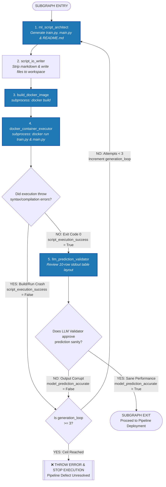

# 📦 Technical Specification & Architecture Blueprint: ML Code Architect & Docker Subprocess Subgraph

This document serves as the master blueprint for the isolated **ML Code Architecture & Docker Subprocess Execution Subgraph** of the Automated Machine Learning pipeline. It captures the updated global state variables, the Docker build and containerized execution sequence, terminal data sampling formatting guidelines, and self-healing loop guardrails designed to eliminate runtime failures.

---

## 🛠️ 1. Subgraph State Contract (`MLState`)

The subgraph reads, updates, and passes along the complete, unified parent `MLState` dictionary. The schema is updated here to track multiple generated code files (`train.py`, `main.py`, and a workspace `README.md`) alongside evaluation flags:

```python
from typing import TypedDict, Optional, List, Dict, Any, Union

class MLState(TypedDict):
    """Main state object managing data trajectories across decoupled nodes."""
    
    # ----------------------------------------------------------------
    # Host Environment Inputs & Cloned Workspace Directories
    # ----------------------------------------------------------------
    [cite_start]target_path: str                  # Original directory folder provided by host prompt [cite: 209]
    [cite_start]clone_workspace: str              # Isolated workspace path, e.g., .../.temp/ml_agent_6279f94e [cite: 209]
    [cite_start]all_files: List[str]              # Absolute paths of raw files copied into the datasets/ folder [cite: 210]
    
    # Clean split dataset file paths generated inside processed-datasets/
    [cite_start]train_path: str                  # Path to processed-datasets/train_dataset.csv [cite: 210]
    [cite_start]test_path: str                   # Path to processed-datasets/test_dataset.csv [cite: 210]
    
    # ----------------------------------------------------------------
    # Target & Algorithm Selection Metadata (From Analytics Phase)
    # ----------------------------------------------------------------
    [cite_start]target_recommendations: List[Dict[str, Any]] [cite: 211]
    [cite_start]chosen_target: Optional[Union[str, List[str]]]  # Selected target feature column(s) (string or list) [cite: 211]
    [cite_start]problem_type: Optional[str]       # Inferred task: "Classification" or "Regression" [cite: 211]
    [cite_start]algorithm_recommendations: List[Dict[str, Any]] [cite: 211]
    [cite_start]chosen_algorithm: Optional[str]   # Selected model architecture (e.g., "XGBoostClassifier") [cite: 211]
    
    # ----------------------------------------------------------------
    # 📦 ML Code Generation & Sandbox Architecture Extensions
    # ----------------------------------------------------------------
    [cite_start]generated_code_rationale: Optional[str]   # Architectural explanation generated by LLM code planner [cite: 212]
    
    # Standalone Code & Documentation Scripts (Aligned with actual filenames)
    train_script_code: Optional[str]         # Code string for model training execution (train.py)
    evaluation_script_code: Optional[str]    # Code string for 10-row validation inference (main.py)
    workspace_readme_text: Optional[str]     # Markdown explanation text explaining this specific pipeline variant
    
    # Dual-Gate Execution Verification Flags
    [cite_start]script_execution_success: Optional[bool]  # True if Docker build AND train.py + main.py run with exit code 0 [cite: 213]
    [cite_start]model_prediction_accurate: Optional[bool] # True if LLM Validator approves the 10-row stdout table matrix [cite: 213]
    
    # Standard I/O Streams captured from Docker subprocess CLI
    [cite_start]runtime_stdout: Optional[str]             # Captured terminal logs, outputs, and prints from container runs [cite: 213]
    [cite_start]runtime_stderr: Optional[str]             # Captured terminal error traces or Docker build crashes [cite: 213]
    
    # ----------------------------------------------------------------
    # Local Self-Healing Loop Feedbacks
    # ----------------------------------------------------------------
    [cite_start]is_data_valid: bool               # Validation flag populated by the AI Validator Node [cite: 214]
    [cite_start]consolidation_feedback: Optional[str] # Holds traceback logs/remediation text if verification gates fail [cite: 214]
    [cite_start]retry_counters: Dict[str, int]    # Loop iteration registry: {"ingestion_loop": 0, "generation_loop": 0} [cite: 214]
    
    # ----------------------------------------------------------------
    # Token Tracking Operations
    # ----------------------------------------------------------------
    [cite_start]token_count: int                  # Global continuous cumulative token burn tracker [cite: 215]
    [cite_start]node_tokens: Dict[str, int]       # Local dictionary mapping node keys to token values [cite: 215]

```

---

## 🏎️ 2. Subgraph Execution Flow

The architecture implements a dual-gate validation checkpoint using standard host system terminal `docker` CLI commands passed via `subprocess.run()`.



---

## 🔍 3. Subgraph Node Definitions

### Phase A: Core Generation & File IO Serialization

#### 1. `ml_script_architect` (AI Code Generation Engine)

* 
**Function:** Ingests the `chosen_target` , `chosen_algorithm` , the absolute string path `train_path` , and the structural task layout `problem_type`. It calls a structured LLM to generate code tailored to a pre-defined environment configuration.


* **Optimized Docker Environment Build Policy:** To avoid long build times and heavy token usage, **the host project dependencies are already pre-installed in your development environment**. The `Dockerfile` instructions leverage the pre-installed versions of your core packages to run instantly. The system prompt forces the LLM to write scripts utilizing **only** the primary subset of your core system requirements:
* `pandas>=3.0.3` (loading data matrices and feature vectors safely)
* `numpy>=2.4.6` (handling multi-dimensional arrays or mathematical shapes)
* `scikit-learn>=1.9.0` (handling metrics evaluation, models, and preprocessing steps)
* `xgboost>=3.2.0` (running tree boosting structures if requested)
* `joblib>=1.5.3` (serializing final fitted model files to disk)


*The LLM is strictly prohibited from introducing unlisted external modules (such as lightgbm, tensorflow, keras, pytorch, or visualization libraries like matplotlib and seaborn) to prevent environment mismatches.*
* **Prompt Specification for Evaluation Script (`main.py`):** The LLM is instructed to write `main.py` such that it slices **exactly the first 10 rows** from the test dataset using `head(10)`, matches column types, performs inference using the saved `model.joblib`, and prints out a tabular overview directly to `stdout`:
```text
================================================================================
                    HOLDOUT VALIDATION PREDICTION SNAPSHOT (10 ROWS)
================================================================================
 Row | Feature_A | Feature_B | ... | GROUND TRUTH TARGET | MODEL PREDICTION
--------------------------------------------------------------------------------
  1  |   54.2    |    1.0    | ... |         1.0         |       1.0 (✓)
...

```


* 
**State Updates:** Writes textual planning to `generated_code_rationale`, training source code to `train_script_code`, inference testing script code to `evaluation_script_code`, and customized documentation layout to `workspace_readme_text`.


#### 2. `script_io_writer` (System File IO Operator)

* **Function:** References the strings `train_script_code`, `evaluation_script_code`, and `workspace_readme_text`. It runs deterministic regular expressions to strip out markdown tags (like ````python`) and whitespace anomalies.
* **File Layout Construction:** It saves the text blocks directly into the root directory of the active `clone_workspace` path as:
* `train.py` (The model training script file)
* `main.py` (The 10-row matrix sampling test evaluation file)
* `README.md` (Custom project documentation file)


* **Programmatic Dockerfile Generation (Incremental Build Policy):** It outputs a standalone file named **`Dockerfile`** into the workspace root. To ensure speed, it only reinstalls the core requirements that are strictly necessary for training execution:
```dockerfile
FROM python:3.10-slim
WORKDIR /workspace
RUN pip install --no-cache-dir "pandas>=3.0.3" "numpy>=2.4.6" "scikit-learn>=1.9.0" "xgboost>=3.2.0" "joblib>=1.5.3"
COPY train.py main.py ./

```


* **State Updates:** Modifies nothing in the state; pushes all validated code assets directly to disk.

---

### Phase B: Sandbox Evaluation & Self-Healing Loop

#### 3. `build_docker_image` (Subprocess Container Builder)

* **Function:** Spawns a local host process to build the execution environment using standard terminal commands. It targets the workspace directory natively:
```python
import subprocess
result = subprocess.run(
    ["docker", "build", "-t", "ml-agent-pipeline:latest", "."],
    cwd=clone_workspace, capture_output=True, text=True
)

```


* **State Updates:**
* If `result.returncode == 0`: `script_execution_success` is initialized to `True` , and build history is written to `runtime_stdout`.


* If `result.returncode != 0`: `script_execution_success` maps to `False` , the error log is saved in `runtime_stderr`, and execution routes immediately to the self-healing block (skipping execution steps entirely).


#### 4. `docker_container_executor` (Isolated Runtime Supervisor)

* **Function:** Runs the generated pipeline inside an isolated container context using a sequence of standard CLI subprocess commands.
1. **Step 1: Execute Model Training:** Spawns a process to run the training pipeline file inside the built environment container image:
```bash
docker run --name ml-agent-run ml-agent-pipeline:latest python train.py

```


If the execution throws a compilation exception or structural runtime error (`result.returncode != 0`), it captures the container's error stack trace into `runtime_stderr` , sets `script_execution_success = False`, cleans up the stopped container space, and returns immediately.


2. **Step 2: Execute Holdout Sampling Validation:** If training succeeds, it triggers the evaluation file:
```bash
docker run --rm --volumes-from ml-agent-run ml-agent-pipeline:latest python main.py

```


It intercepts the terminal logging stream containing the **10-row evaluation matrix layout**.


* 
**State Updates:** Saves the captured 10-row text verification table into `runtime_stdout`. If all subprocess layers finish cleanly with exit status codes of 0, `script_execution_success` is marked as `True`.


#### 5. `llm_prediction_validator` (Semantic Quality Reviewer)

* 
**Function:** Invoked when `script_execution_success` evaluates to `True`. It packages the captured 10-row text matrix layout stored within `runtime_stdout`  into a semantic evaluation prompt. It asks an LLM: *"Do these calculated evaluation values, performance numbers, and category codes reflect a mathematically valid distribution, or does the output behavior display logic inversion, model collapse, or null data artifacts?"*


* **State Updates:**
* If the LLM validator approves the output pattern: Sets `model_prediction_accurate = True`  and exits the subgraph.


* If the LLM validator flags anomalies: Captures specific remediation instructions, saves them into `consolidation_feedback` , and sets `model_prediction_accurate = False`.


---

## 🛑 4. Runaway Loop Prevention Gateways (Circuit Breakers)

The graph controls self-healing traffic dynamically after the execution phase finishes by evaluating the tracking keys using a central router node (`route_generation_loop`).

```python
def route_generation_loop(state: MLState) -> str:
    """Evaluates compilation and semantic checks over strict retry loops."""
    # Condition 1: Clean exit path - Everything compiled and predictions look sane
    if state.get("script_execution_success") is True and state.get("model_prediction_accurate") is True:
        return "clear_to_exit"
        
    # Condition 2: Catch failure, evaluate loop iteration thresholds
    retry_counters = state.get("retry_counters", {})
    generation_loops = retry_counters.get("generation_loop", 0)
    
    # Absolute Circuit Breaker: Halt execution immediately upon 3 failed fix cycles
    if generation_loops >= 3:
        print(f"\n[CRITICAL ERROR] Subgraph aborted. Code failed to heal within {generation_loops} attempts.")
        return "force_halt_pipeline"
        
    # Valid attempt remains: Increment generation tracker and route to architect node
    retry_counters["generation_loop"] = generation_loops + 1
    return "trigger_code_repair"

```

### Action Plans on Trajectory Branches:

* `clear_to_exit`: Hand-off successfully complete. The subgraph terminates gracefully and passes the validated workflow parameters down to deployment pipelines (`END`).
* `trigger_code_repair`: Loops back to `ml_script_architect`. The node reviews the failing version of the script paired alongside the targeted exception log (`runtime_stderr`) or semantic review text (`consolidation_feedback`)  to debug the system and output corrected files.


* `force_halt_pipeline`: Immediately terminates downstream workflow operations, logs a traceback error summary, locks state flags, and updates the local state JSON file to disk to preserve API token usage limits.